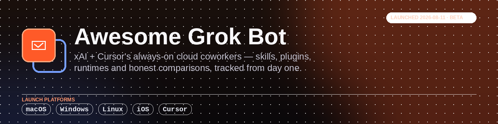

  

  
  
  
  
  
  

# Awesome Grok Bot

**A curated, verified directory of 20 Grok Bot skills, plugins, MCP servers and self-hosted alternatives.**
[Grok Bot](https://docs.x.ai/grok-bot/overview) is xAI/SpaceXAI and Cursor's always-on AI teammates, each
with their own persistent cloud computer. It launched in beta on 2026-08-11 and this list has tracked the
ecosystem from day one.

Everything here is checked against a primary source, including the honest read on how Grok Bot is actually
extended, which is not what most write-ups assume. This is an unofficial, community-maintained list and is
not affiliated with or endorsed by xAI/SpaceXAI or Cursor.

---

## Contents

- [What is Grok Bot? (and how do you actually extend it?)](#what-is-grok-bot-and-how-do-you-actually-extend-it)
- [Grok Bot pricing and how to get it](#grok-bot-pricing-and-how-to-get-it)
- [Grok Bot vs OpenClaw vs Hermes Agent](#grok-bot-vs-openclaw-vs-hermes-agent)
- [⭐ Pick of the Week](#-pick-of-the-week)
- [Grok Bot events and community](#grok-bot-events-and-community)
- [The catalog: Grok Bot skills, plugins and MCP](#the-catalog-grok-bot-skills-plugins-and-mcp)
- [🛡️ Security notice](#️-security-notice)
- [🤝 Contributing](#-contributing)
- [Related lists](#related-lists)

---

## What is Grok Bot? (and how do you actually extend it?)

**Grok Bot** ships from xAI/SpaceXAI *and* Cursor jointly — it is not the same product as **Grok Build**
(xAI's separate, open-sourced coding CLI/TUI agent) or plain **Grok** (the chat assistant). Bots are
"AI teammates you can give real work to": each user gets **one persistent, shared cloud computer** — a
browser, filesystem and terminal — that keeps running when your laptop is closed. Files, browser sessions and
app logins persist across tasks and across every Bot on the account (isolation is per-*user*, not per-Bot;
each Bot gets its own screen on the shared machine so several can work in parallel).
([docs.x.ai/grok-bot/overview](https://docs.x.ai/grok-bot/overview))

**How it's actually extended — four distinct mechanisms, verified against xAI's own docs and real installs
in the wild, not assumed:**

1. **Cursor's plugin + MCP marketplace.** Per xAI's own docs: *"Grok Bot follows your team's existing Cursor
   plugin and MCP policy. There are no separate Grok Bot plugin controls."* ([docs.x.ai/grok-bot/teams-and-enterprises](https://docs.x.ai/grok-bot/teams-and-enterprises))
   Team plans add "a team marketplace for internal rules, skills, and plugins." **This is the part worth
   getting right, because it's easy to assume wrong:** the real plugins we found in the wild
   ([`useorgx/orgx-grokbot-plugin`](https://github.com/useorgx/orgx-grokbot-plugin),
   [`GrokBotfun/GrokBotfun`](https://github.com/GrokBotfun/GrokBotfun)) ship in Cursor's **pre-existing,
   proprietary `.cursor-plugin/plugin.json` marketplace format** (or a Bot-specific `.grok-plugin/plugin.json`
   variant) — **not** the new open [Agent Plugins](https://agentplugins.codes/) standard that Cursor itself
   helped launch five days before Grok Bot shipped, despite one repo's README describing itself as
   "agent-plugins.org spec." xAI's own
   [official plugin marketplace](https://github.com/xai-org/plugin-marketplace) settles it: its manifests live in
   `.grok-plugin/` (`marketplace.json` plus a per-plugin `plugin.json`), and **not one of its 20 published
   plugins carries the open spec's required `$schema`** — every manifest re-checked 2026-08-24, unchanged
   from the 2026-08-17 check apart from two new plugins.
   The cleanest evidence is a vendor that ships both: **Neon** publishes
   [`neondatabase/agent-skills`](https://github.com/neondatabase/agent-skills) with the canonical
   `https://agent-plugins.org/schemas/1.0.0/plugin.schema.json` `$schema`, and separately ships
   `external_plugins/neon/.grok-plugin/plugin.json` into xAI's marketplace with **no `$schema` at all**.
   Same company, same product, two manifest formats, one per ecosystem. That is the gap, stated by
   someone other than us. Plugins are
   marketplace bundles of connectors and skills, managed through Cursor-side tools (`SearchPlugins`,
   `InstallPlugin`, `AddMcpServer`, `AuthenticateMcpServer`) and surfaced in
   **App Settings → Plugins → Marketplace / Yours**.

   We'll flip this the moment a real `plugin.json` targeting
   the open spec shows up for Grok Bot — see [awesome-agent-plugins](https://github.com/ZeroPointRepo/awesome-agent-plugins),
   our sister list, which already tracks 33 verified plugins on the open standard.
2. **Computer use.** Bots operate apps and websites directly — including ones with no clean API or MCP
   connection at all — by driving the browser/desktop the same way a person would.
3. **Learned routines.** Demonstrate a workflow once; the Bot saves the path as a routine and repeats/adapts
   it later, corrections included.
4. **Skills.** Reusable capability packs, conceptually the same idea as Agent Skills (a `SKILL.md` plus
   optional scripts) — confirmed in docs and in real installs like
   [`jeffhuber/grokbot-imessage-skill`](https://github.com/jeffhuber/grokbot-imessage-skill).

## Grok Bot pricing and how to get it

Grok Bot is **not sold standalone** — it rides on three existing premium plans, and there's no free tier:

| Plan | Price | What it adds |
|---|---|---|
| **SuperGrok Heavy** | $300/mo | xAI's own top consumer tier; Grok Bot included |
| **Cursor Ultra** | $200/mo | Bot's own cloud computer, tool sign-ins, scheduled routines, desktop + mobile access, extended token limits |
| **Cursor Premium Teams** | $120/seat/mo | Adds centralized billing, the team plugin/skills marketplace, shared usage analytics, SAML/OIDC SSO |

Platforms at launch (2026-08-11, beta): **macOS** (Apple silicon & Intel), **Windows** 10/11 x64, **Linux**
(Debian/Ubuntu x64), **iOS**. **Android**: coming soon, no date. No confirmed dedicated web client — don't
assume the ordinary Grok web app carries Bot features.
([kingy.ai — pricing/platform breakdown](https://kingy.ai/blog/what-is-grok-bot/), cross-checked against
[docs.x.ai](https://docs.x.ai/grok-bot/overview))

Exact weekly usage allowances and Bot/concurrency limits per plan are **not published** — treat any specific
number you see elsewhere as unconfirmed until xAI states it.

## Grok Bot vs OpenClaw vs Hermes Agent

| | **Grok Bot** | **OpenClaw** | **Hermes Agent** |
|---|---|---|---|
| Model | Proprietary (Grok), xAI-hosted | Bring-your-own-model | Model-agnostic |
| Hosting | xAI/Cursor-managed shared cloud computer | Self-hosted, your hardware | Self-hosted / hybrid |
| Cost | $120–$300/mo, bundled into existing plans, no free tier | Free, open source | Free, open source |
| GitHub stars | Closed product, so not comparable — the third-party ecosystem is 13 days old and its largest repo is xAI's own marketplace at 173★ | **387,285★** ([openclaw/openclaw](https://github.com/openclaw/openclaw)) | **235,348★** ([NousResearch/hermes-agent](https://github.com/NousResearch/hermes-agent)) |
| Extends via | Cursor plugin/MCP marketplace, computer use, learned routines | Multi-channel plugins (WhatsApp, Telegram, Slack, Discord) | Skills, tools, memory providers, plugins |
| Best fit | Teams already paying for Cursor/SuperGrok who want an always-on coworker with zero infra to run | Full control, multi-channel personal assistant, zero cost | Background execution, personalization that compounds over time |

Star counts re-pulled from the GitHub API 2026-08-24. On repos this size they move daily, so treat them as a snapshot rather than a fact.

## ⭐ Pick of the Week

**[chrome-devtools](https://github.com/ChromeDevTools/chrome-devtools-mcp)** by
[Chrome DevTools](https://github.com/ChromeDevTools) — the pick that actually exploits what makes a Bot
different. Every other agent runs a browser it has to start, drive and tear down; a Bot already has one
running on a machine that stays up when your laptop is closed, with your logins still in it. This plugin
gives it the DevTools protocol on top: record a performance trace, read network requests, pull console
errors with source-mapped stack traces.

The practical consequence is that "the page is slow" and "it breaks for some users" stop being things you
describe to the agent and become things it measures. Note it drives a **live, shared** browser with your
real sessions in it, so scope what you ask for accordingly.

Install from **App Settings → Plugins → Marketplace** and search `chrome-devtools`.

Last week's pick, [superpowers](https://github.com/obra/superpowers), remains in the catalog.

*Rotates weekly. Nominate an entry by opening an issue.*

---

## Grok Bot events and community

### Upcoming Grok Bot meetups, workshops and hackathons

| Where | Event | When (local) | |
|---|---|---|---|
| Shenzhen, CN | Grok Bot Meetup Shenzhen | Aug 30, 14:00 (UTC+8) | [Register](https://luma.com/5vkzzvqk) |
| Barranquilla, CO | Grokbot Hackathon Barranquilla | Sep 3, 16:00 (UTC-5) | [Register](https://luma.com/lgttu49h) |
| San Francisco, US | Grok Bot build night for women | Sep 3, 17:00 (UTC-7) | [Register](https://luma.com/cursor-rset) |
| Macau | Grok Bot Macau Student Workshop | Sep 5, 14:30 (UTC+8) | [Waitlist](https://luma.com/cursor-macau-creativity-workshop-2026-sep) |
| Tel Aviv, IL | Grok Bot Meetup Tel Aviv | Sep 8, 18:00 (UTC+3) | [Register](https://luma.com/cursor-qdl0) |
| Monterrey, MX | Grok Meetup Monterrey | Sep 10, 18:00 (UTC-6) | [Register](https://luma.com/cursor-wgsj) |
| Las Vegas, US | Grok Bot Meetup Las Vegas | Sep 15, 18:00 (UTC-7) | [Register](https://luma.com/cursor-kaua) |
| Monterrey, MX | Grok Monterrey Hackathon | Oct 3, 10:00 (UTC-6) | [Register](https://luma.com/5ohq71b3) |

### Where the Grok Bot community talks

- [Cursor Community Forum, `grok-bot` tag](https://forum.cursor.com/tag/grok-bot) — where Grok Bot bug reports, plugin OAuth failures, feature requests and every meetup above get posted.
- [Cursor Discord](https://discord.gg/cursor) — 38,000+ members, real-time chat with the people using it.
- [r/cursor](https://www.reddit.com/r/cursor/) — release chatter, setups and workflows.
- [Cursor Community events calendar](https://luma.com/cursorcommunity) — every meetup worldwide, Grok Bot and otherwise, as it gets scheduled.

---

## The catalog: Grok Bot skills, plugins and MCP

Format: `- [name](repo-url) by [author](author-url) — one-line description. **[tag]**`
Tags: **production** · **beta** · **experimental** · **guide** (docs/notes, not runnable)

*The community half of this ecosystem is under a week old — most third-party repos below were created
2026-08-11 or 2026-08-12 and still have a handful of stars. The official marketplace plugins are the
exception: those are established vendor tools that xAI has published into `.grok-plugin` format. We label
which is which rather than blurring them together, and empty subsections stay labeled rather than stretched.*

### Grok Bot skills

- [grok-bot-super](https://github.com/AgentMindCloud/grok-bot-super) by [AgentMindCloud](https://github.com/AgentMindCloud) — community skill library (daily standup, email triage, meeting-to-actions, research brief, weekly review, X-thread builder). **[beta]**
- [grok-bot-templates](https://github.com/cobusgreyling/grok-bot-templates) by [cobusgreyling](https://github.com/cobusgreyling) — scored operating contracts (job, never-list, L1 default, CI). Paste START.md, tap a team. **[beta]**
- [grokbot-imessage-skill](https://github.com/jeffhuber/grokbot-imessage-skill) by [jeffhuber](https://github.com/jeffhuber) — read, triage, search and send iMessages on macOS via a local, privacy-first launchd helper (no cloud sync). **[beta]**
- [HyperGrok](https://github.com/galleonlabs/hypergrok-trading-desk) by [galleonlabs](https://github.com/galleonlabs) — seven-agent Hyperliquid trading desk for Grok Bot: research, size, execute, review. **[beta]**

### Grok Bot plugins and MCP servers

- [agentcouch](https://github.com/stoyan-stoyanov/agentcouch-plugins) by [AgentCouch](https://agentcouch.dev) — hosted messaging rooms for Grok Bot to talk with other people's agents across clients and machines. **[production]**
- [GrokBotfun](https://github.com/GrokBotfun/GrokBotfun) by [GrokBotfun](https://github.com/GrokBotfun) — deploy pump.fun tokens from your agent; ships an MCP server plus a Cursor-marketplace-format plugin (not the open agent-plugins.org spec, despite the repo description). **[experimental]**
- [orgx-grokbot-plugin](https://github.com/useorgx/orgx-grokbot-plugin) by [OrgX](https://useorgx.com) — OrgX MCP wiring, initiative-aware skills and specialist agent packs, packaged in Cursor's `.grok-plugin` manifest format. **[beta]**

#### Official xAI plugin marketplace

xAI runs an [official plugin marketplace](https://github.com/xai-org/plugin-marketplace) — 18 vendor plugins in
`.grok-plugin` format, the same plugin surface Grok Bot inherits under Cursor's plugin/MCP policy. A curated
selection follows; browse the marketplace for the full set.

- [chrome-devtools](https://github.com/ChromeDevTools/chrome-devtools-mcp) by [Chrome DevTools](https://github.com/ChromeDevTools) — drive and inspect a live Chrome: performance traces, network requests, source-mapped console errors. **[production]**
- [cloudflare](https://github.com/cloudflare/skills) by [Cloudflare](https://github.com/cloudflare) — manage Workers, KV, R2, DNS and deployments from the agent. **[production]**
- [figma](https://github.com/figma/mcp-server-guide) by [Figma](https://github.com/figma) — read designs, variables and components straight out of Figma files. **[production]**
- [mongodb](https://github.com/mongodb/agent-skills) by [MongoDB](https://github.com/mongodb) — query collections, inspect schemas and manage Atlas clusters. **[production]**
- [railway](https://github.com/railwayapp/railway-skills) by [Railway](https://github.com/railwayapp) — deploy services, read build logs and manage environment variables. **[production]**
- [stripe](https://github.com/stripe/ai) by [Stripe](https://github.com/stripe) — payments, subscriptions and billing objects from the agent, test mode included. **[production]**
- [superpowers](https://github.com/obra/superpowers) by [obra](https://github.com/obra) — the largest general skill collection shipped in the marketplace; planning, debugging and writing workflows. **[production]**
- [vercel](https://github.com/vercel/vercel-plugin) by [Vercel](https://github.com/vercel) — manage deployments, check build status, read logs, configure domains. **[production]**
- [xai-org/plugin-marketplace](https://github.com/xai-org/plugin-marketplace) by [xAI](https://github.com/xai-org) — the official marketplace itself: 18 vendor plugins plus the `.grok-plugin` manifest format they all use. **[production]**

### Self-hosted Grok Bot alternatives, runtimes and bridges

- [grok-bot-flake](https://github.com/jordangarrison/grok-bot-flake) by [jordangarrison](https://github.com/jordangarrison) — Nix flake that repackages the official Linux `.deb` (no source build). **[experimental]**
- [grok-bot-setup](https://github.com/BlockedPath/grok-bot-setup) by [BlockedPath](https://github.com/BlockedPath) — adapters CLI and custom model-provider bridges (DeepSeek, Claude, Grok, OpenAI). **[beta]**
- [OpenGrokBot](https://github.com/wolfqing/OpenGrokBot) by [wolfqing](https://github.com/wolfqing) — self-hosted, open-source Grok Bot alternative assembled from OpenClaw plus any model you bring; your hardware, your credentials. **[beta]**
- [sand](https://github.com/alokwhitewolf/sand) by [alokwhitewolf](https://github.com/alokwhitewolf) — unofficial terminal bridge to message your Bots from the CLI, since Grok Bot doesn't ship one. **[experimental]**

### Grok Bot guides and tutorials

- [grok-bot-info](https://github.com/Uncle-Gizmo/grok-bot-info) by [Uncle-Gizmo](https://github.com/Uncle-Gizmo) — public notes on what Grok Bot is for, safe example workflows, and how it fits alongside Grok Build and Grok Heavy. **[guide]**
- [grok-bot-intro-v2](https://github.com/520xiaomumu/grok-bot-intro-v2) by [520xiaomumu](https://github.com/520xiaomumu) — 12-chapter Chinese-language autoplay intro deck. **[guide]**

## Cross-reference

If Grok Bot's plugin ecosystem moves onto the open standard (see above — it hasn't, as of this writing),
those plugins will be interoperable with every other launch client. Track that standard at our sister list:
**[ZeroPointRepo/awesome-agent-plugins](https://github.com/ZeroPointRepo/awesome-agent-plugins)** — 33 verified
Agent Plugins across ChatGPT, Codex, Cursor, GitHub Copilot, Kiro and VS Code.

## 🛡️ Security notice

This is a **curated list, not an audit**. A "beta" or "production" tag means the repo is real and functional
at the time it was checked — it is not a safety review. Several entries above ask for real credentials
(private keys, tool sign-ins, local message-database access): read the code before you grant anything,
exactly as you would for any browser extension or CLI tool. **The Grok Bot ecosystem is under 48 hours old at
the time of writing** — expect churn, expect some of these repos to disappear or go stale fast, and expect
this list to change quickly along with it.

## 🤝 Contributing

PRs are very welcome — see [CONTRIBUTING.md](CONTRIBUTING.md) for the format and the acceptance rules.

---

## Related lists

Sister lists, same standard, same maintainer. Each one covers a different agent ecosystem.

- [awesome-hermes-skills](https://github.com/ZeroPointRepo/awesome-hermes-skills): skills, plugins, agent profiles and memory providers for Hermes Agent.
- [awesome-agent-plugins](https://github.com/ZeroPointRepo/awesome-agent-plugins): plugins on the open Agent Plugins standard, every entry checked for a real `plugin.json`.
- [awesome-dsh-plugins](https://github.com/ZeroPointRepo/awesome-dsh-plugins): DeepSeek Harness plugins organized by what they do, every install command re-checked weekly by CI.
- [awesome-fx-skills](https://github.com/ZeroPointRepo/awesome-fx-skills): skills, MCP servers and subagents for Vercel's fx coding agent, every install command machine-checked weekly.
- [awesome-cursor-plugins](https://github.com/ZeroPointRepo/awesome-cursor-plugins): Cursor plugins from the official marketplace, including the ten that also ship a `.grok-plugin` manifest and therefore load in a Bot.
- [awesome-praxist-plugins](https://github.com/ZeroPointRepo/awesome-praxist-plugins): Praxist plugins for Sapient's autonomous research system, every row carrying the kind, stability and API key read straight out of its manifest.

---

Maintained by <a href="https://github.com/ZeroPointRepo">ZeroPointRepo</a> · list content licensed
<a href="https://creativecommons.org/licenses/by/4.0/">CC BY 4.0</a> · Built with <a href="https://crhq.ai">crhq.ai</a>
 
This is an unofficial, community-maintained list. It is not affiliated with or endorsed by xAI/SpaceXAI
or Cursor.

